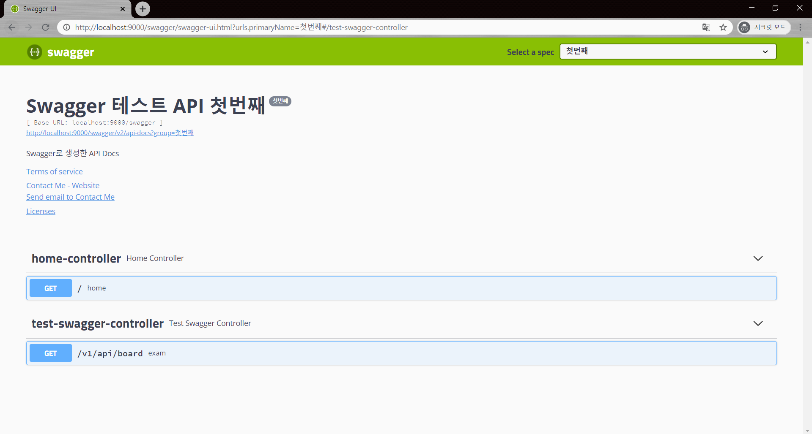

# SpringMVC Swagger 테스트
> Swagger는 RESTfull API 문서를 만들어준다.
>
> 간단한 설정으로 프로젝트에 지정한 URL들을 HTML 화면으로 확인

### 설정

1. pom.xml에 dependency 추가 (swagger + jackson)
2. SwaggerConfig.java 추가 : swagger 설정 파일
3. TestSwaggerController.java 추가 :  API테스트 Controller 

### 참고

* https://victorydntmd.tistory.com/341
* https://thingsthis.tistory.com/320